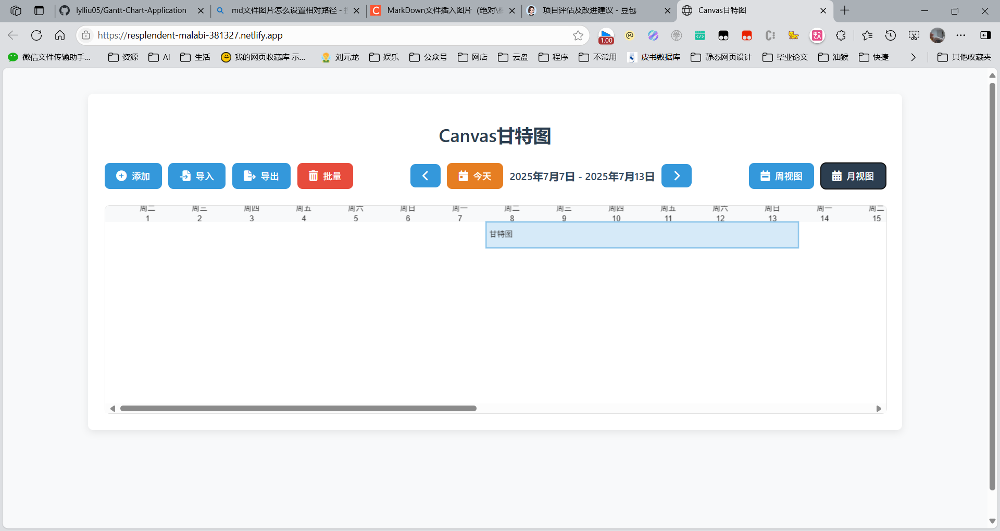

# 甘特图应用 v0.1.2 (Gantt Chart Application)



一个基于Web的甘特图应用，帮助用户可视化和管理项目任务时间线。

## 项目结构

### 文件说明
| 文件名 | 作用 |
|--------|------|
| index.html | 应用入口页面，加载所有资源文件 |
| script.js | 主逻辑文件，包含甘特图核心功能 |
| style.css | 主样式文件，定义应用整体样式 |
| import-helper.js | 导入功能模块，处理数据导入逻辑 |
| import-styles.css | 导入相关样式文件 |

### 依赖关系
- `index.html` 依赖 `script.js` 和 `style.css`
- `script.js` 依赖 `import-helper.js` 处理导入功能
- 样式文件相互独立，分别应用于不同模块

## 功能特点

- 可视化任务时间线
- 支持周视图和月视图切换
- 任务添加、编辑和删除
- 任务进度跟踪
- 数据导入导出(JSON格式)
- 本地数据存储(IndexedDB)

## 安装指南

### 前置要求
- 现代浏览器(Chrome/Firefox/Edge最新版)
- Node.js(可选，用于开发)

### 快速开始
1. 克隆仓库:
   ```bash
   git clone https://github.com/lylliu05/Gantt-Chart-Application.git
   ```
2. 访问 https://resplendent-malabi-381327.netlify.app/

## 使用说明

### 基本操作
- 点击"添加任务"按钮创建新任务
- 点击任务条可编辑任务
- 使用左右箭头按钮导航时间线
- 点击"今天"按钮返回当前日期

### 数据导入导出
1. 点击"导出"按钮下载当前数据(JSON格式)
2. 点击"导入"按钮选择JSON文件导入数据

支持两种导入模式:
- **替换模式**: 完全替换现有任务
- **合并模式**: 保留现有任务，仅更新匹配ID的任务

## 贡献指南

欢迎贡献代码!请遵循以下步骤:

1. Fork项目
2. 创建特性分支(`git checkout -b feature/AmazingFeature`)
3. 提交更改(`git commit -m 'Add some AmazingFeature'`)
4. 推送到分支(`git push origin feature/AmazingFeature`)
5. 发起Pull Request

## 许可证

[MIT](https://choosealicense.com/licenses/mit/)

## 联系方式

如有问题或建议，请联系: 1369785290@qq.com
